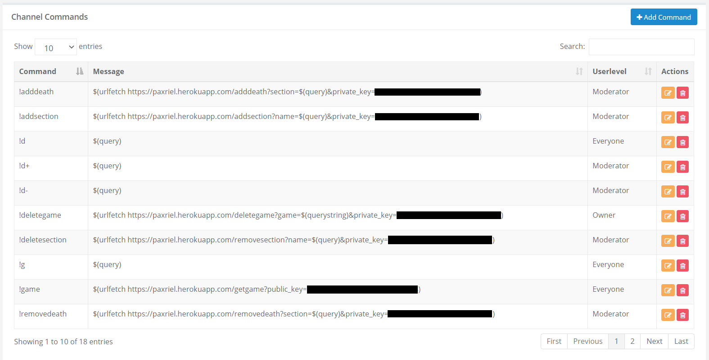
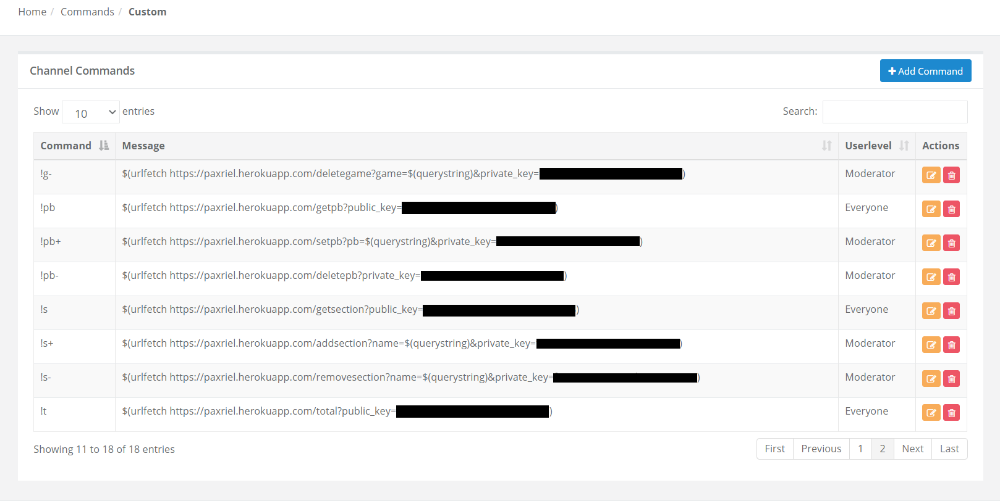
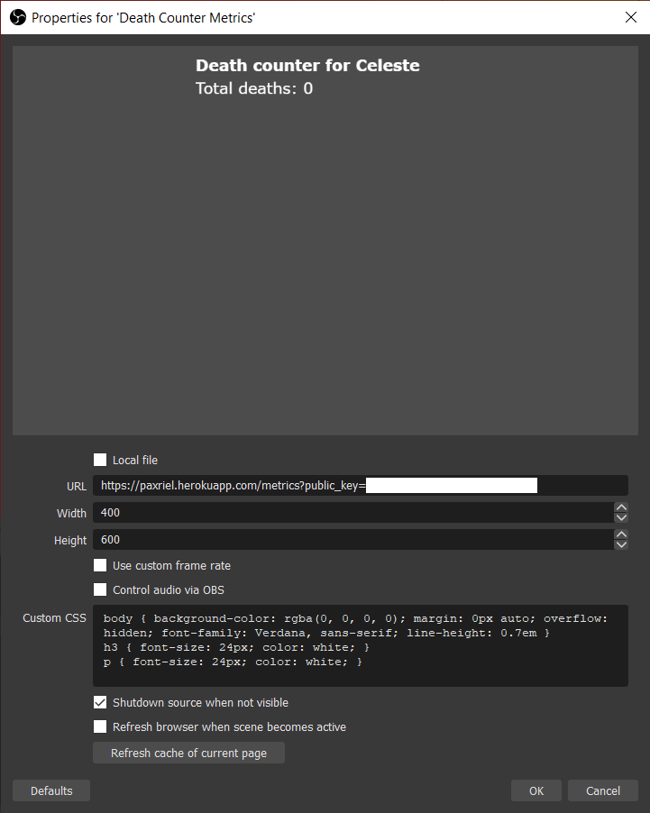

# Deaths API

This is an API for recording your deaths using GET requests. This allows for it to be used with bots like NightBot.

## Possible Requests

### /getgame

Description: Gets the game that is currently selected.

Query Parameters:
| Parameter | Usage |
|-|-|
| public_key | The public key for the API. |

### /setgame

**Description:** Sets the current game.

**Query Parameters:**
| Parameter | Usage |
|-|-|
| private_key | The private key of the API |
| game | The game that will be set as the current game |

### /deletegame

**Description:** Deletes all sections in a game.

**Query Parameters:**
| Parameter | Usage |
|-|-|
| private_key | The private key of the API |
| game | The game data that will be cleared (Optional, defaults to the current game) |

### /getsection

**Description:** Gets the total amount of sections in the game (Without deaths).

**Query Parameters:**
| Parameter | Usage |
|-|-|
| public_key | The public key of the API |
| game | The game for the total amount of sections (Optional, defaults to the current game) |

### /addsection

**Description:** Adds a section to the game.

**Query Parameters:**
| Parameter | Usage |
|-|-|
| private_key | The private key of the API |
| game | The game for the total amount of sections (Optional, defaults to the current game) |
| name | The name of the section that would be added |

### /removesection

**Description:** Removes a section from the game.

**Query Parameters:**
| Parameter | Usage |
|-|-|
| private_key | The private key of the API |
| game | The game for the total amount of sections (Optional, defaults to the current game) |
| name | The name of the section that would be added |

### /getdeath

**Description:** Gets the total number of deaths of a specified section of the game.

**Query Parameters:**
| Parameter | Usage |
|-|-|
| public_key | The public key of the API |
| game | The game specified (Optional, defaults to the current game) |
| section | The name of the section |

### /adddeath

**Description:** Adds a death to the specified section of the game.

**Query Parameters:**
| Parameter | Usage |
|-|-|
| private_key | The private key of the API |
| game | The game specified (Optional, defaults to the current game) |
| section | The name of the section |

### /removedeath

**Description:** Removes a death from the specified section of the game.

**Query Parameters:**
| Parameter | Usage |
|-|-|
| private_key | The private key of the API |
| game | The game specified (Optional, defaults to the current game) |
| section | The name of the section |

### /setdeath

**Description:** Sets the death count of a specified section to a specific amount.

**Query Parameters:**
| Parameter | Usage |
|-|-|
| private_key | The private key of the API |
| game | The game specified (Optional, defaults to the current game) |
| content | The section followed by the death count, separated by a space bar, eg. 'Forgotten Crossroads 122' |

### /total

**Description:** Gets the total amount of deaths in the specified game.

**Query Parameters:**
| Parameter | Usage |
|-|-|
| public_key | The public key of the API |
| game | The game specified (Optional, defaults to the current game) |

### /metrics

**Description:** Gets the metrics for the specified game in HTML form.

**Query Parameters:**
| Parameter | Usage |
|-|-|
| public_key | The public key of the API |
| game | The game specified (Optional, defaults to the current game) |

## Installation

### Requirements

* Basic understanding of the command line
* A location to deploy the program, preferably [Heroku](https://devcenter.heroku.com/articles/getting-started-with-nodejs)
* [Git](https://git-scm.com/downloads) (Only if you are deploying using Heroku)
* [Node.JS](https://nodejs.org/en/download/)
* [NPM](https://www.npmjs.com/get-npm) (It should be included within Node.JS)
* A [MongoDB](https://docs.atlas.mongodb.com/getting-started/) database connection URL

### Environment Variables

* PRIVATE_KEY: The private key to create and modify games, sections and deaths.
* PUBLIC_KEY: The public key to read games, sections, deaths and metrics.
* MONGODB_URL: The URL to access your [MongoDB database](https://docs.atlas.mongodb.com/getting-started/).

### Deploying Locally

1. Download the [current repository](https://github.com/paxriel/deaths-api/archive/master.zip)
2. cd to the download location in cmd or bash
3. Run `npm install --production` if you are running on a production server or `npm install` if it is in a development environment
4. Run `PRIVATE_KEY="YourKeyHere" PUBLIC_KEY="YourKeyHere" MONGODB_URL="YourURLHere" npm start`
5. Your server should now be up on `localhost:4001`

### Deploying on Heroku

Assuming that you have a Heroku account and the Heroku CLI is already installed,

1. Download the [current repository](https://github.com/paxriel/deaths-api/archive/master.zip)
2. cd to the download location in cmd or bash
3. Run `npm install --production` if you are running on a production server or `npm install` if it is in a development environment
4. Run `heroku create YourNameHere`
5. Run `heroku config:set PRIVATE_KEY="YourKeyHere"`, `heroku config:set PUBLIC_KEY="YourKeyHere"` and `heroku config:set MONGODB_URL="YourURLHere"`
6. Run `git init`
7. Run `git remote set-url heroku YourHerokuGitURLHere`
8. Run `git add .`, `git commit -m "Initial commit"` and `git push heroku master`
9. Your app is now up on Heroku! If you want to test your app locally, refer to the instructions for deploying locally from Step 3 onwards.

## Example Implementation

| | |
|-|-|
|  |  |
| Nightbot commands - pg 1 | Nightbot commands - pg 2 |
|  | |
| The OBS Browser Source used to display the metrics| |

## Other Alternatives

* [ehsankia's Quote List API](https://community.nightdev.com/t/customapi-quote-system/7871) (You might need a lot of different API keys though)
* Any Excel Application
