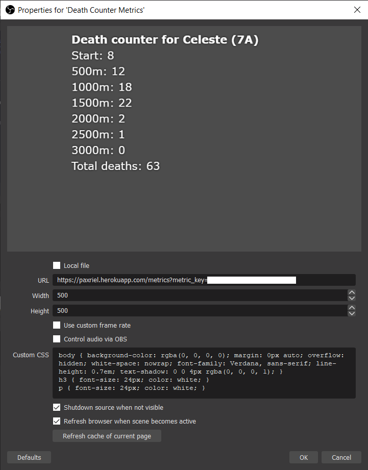

# Deaths API

Deaths API is a website for streamers to host to record in-game death counts. This is intended to be used with one/multiple games that has sections and some sort of death functionality. It can store the deaths data of multiple games at a time in an external database, and contains a metrics page that you can put as a Browser Source in your OBS as well. Each instance of the application is intended to run only for one streamer.

## Structure

Each game will have multiple sections, and each section will have its own death counts. In addition, to allow for easier entry of sections, sections can have aliases that can be used in place of the section names. An example of the structure is shown below:

Game: **Celeste (Farewell)**

| Section | Deaths | Aliases |
|-|-|-|
| Remembered | 123 | r, 1 |
| Event Horizon | 471 | eh, 2 |
| Determination | 1966 | d, 3 |
| Stubbornness | 2079 | s, 4 |
| Reconciliation | 748 | r, 5 |
| Farewell | 365 | f, 6 |

Game: **Hollow Knight**

| Section | Deaths | Aliases |
|-|-|-|
| P1 | 118 | |
| P2 | 201 | |
| P3 | 433 | |
| P4 | 507 | |
| Extra | 1923 | whywontyoudieyoustupidpieceof |

Do note that all games, sections and aliases are case sensitive.

## Commands List

All get commands can be accessed by anyone and are rate limited, whereas the remaining commands can only be accessed by the channel moderators but have no rate limit.

### Game Commands

| Command | Arguments | Function | Requires selected game? | Example |
|-|-|-|-|-|
| !getgame / !g / !game | - | Gets the current game that is selected | Y | !g |
| !removegame / !deletegame | The game that should be deleted (optional) | Deletes either the game that is provided or the game that is selected | N | !deletegame Hollow Knight |
| !setgame | The game that should be selected | Sets the game provided in the argument as the selected game | N | !setGame Hollow Knight |

### Section Commands

| Command | Arguments | Function | Requires selected game? | Example |
|-|-|-|-|-|
| !addsection / !s+ | The name of the section | Adds the section provided by the argument to the selected game | Y | !s+ Power Source |
| !getsection / !s | - | Gets all sections in the selected game | Y | !s |
| !removesection / !deletesection / !s- | The name of the section | Removes the section provided by the argument from the selected game | Y | !s- Power Source |

### Personal Best (PB) Commands

| Command | Arguments | Function | Requires selected game? | Example |
|-|-|-|-|-|
| !getpb / !pb | - | Gets the personal best for the current game | Y | !pb |
| !removepb / !deletepb / !pb- | - | Removes the personal best for the current game | Y | !pb- |
| !setpb / !pb+ | The personal best of the selected game | Sets the personal best for the selected game to the argument value | Y | !pb+ Power Source end part |

### Deaths Commands

| Command | Arguments | Function | Requires selected game? | Example |
|-|-|-|-|-|
| !adddeath / !d+ | The section / alias that the death would be added to | Adds a death to the section provided in the argument | Y | !d+ Power Source |
| !getdeath / !d | The section / alias that the deaths data should be retrieved from | Gets the number of deaths present in the selected section | Y | !d Power Source |
| !removedeath / !deletedeath / !d- | The section / alias that the death would be removed from | Removes a death from the section provided in the argument | Y | !d- Power Source |
| !setdeath / !ds | The section / alias that the death would be added to followed by the death count | Sets the death count of the section to the specified value | Y | !ds Power Source 112 |
| !total / !t | The game that the total deaths should be retrieved from (optional) | Gets the total deaths of the game that is provided or the game that is selected | N | !t Celeste |

### Alias Commands

| Command | Arguments | Function | Requires selected game? | Example |
|-|-|-|-|-|
| !addalias / !a+ | The name of the section followed by the alias (eg. 'Power Source ps') | Allows for the alias entered to be used in place of the section. | Y | !a+ Power Source ps |
| !clearalias / !ac | The name of the section / One of the aliases of the section | Clears all aliases that are previously added for that section. | Y | !ac Power Source |
| !getalias / !a | The name of the section / One of the aliases of the section | Shows all aliases that are in use for that section. | Y | !a Power Source |
| !removealias / !deletealias / !a- | The name of the section followed by the alias (eg. 'Power Source ps') | Removes the alias entered from the section. | Y | !a- Power Source ps |

Note: Aliases cannot have spaces.

## Installation

### Requirements

* Basic understanding of the command line
* A location to deploy the program, preferably Heroku ([Account Creation](https://signup.heroku.com/node), [CLI download](https://devcenter.heroku.com/articles/heroku-cli#download-and-install) and [CLI login](https://devcenter.heroku.com/articles/heroku-cli#getting-started))
* [Git](https://git-scm.com/downloads)
* [Node.JS](https://nodejs.org/en/download/) and [NPM](https://www.npmjs.com/get-npm)
* A [MongoDB](https://docs.atlas.mongodb.com/getting-started/) database connection URL

### Set up OAuth

TODO: Complete

### Environment Variables

* LOCALE: The locale file to be used. Defaults to en-gb.
* METRIC_KEY: The key to view the metrics page. This key can be provided to your viewers for them to view the current metrics in a browser. However, doing so risks having your server and / or database being overloaded due to the large amount of requests received from the viewers. Hence, it is **not recommended** to publicize this key.
* MONGODB_URL: The URL to access your [MongoDB database](https://docs.atlas.mongodb.com/getting-started/).
* PORT: The port that the server will be deployed on. (Optional, defaults to 4001)
* REFRESH_DURATION: The duration that the metrics page refreshes. (Optional, defaults to 15)
* LOCALE: The language file used for the messages. (Optional, defaults to en-gb)
* TWITCH_BOT_ACCESS:
* TWITCH_BOT_REFRESH:
* TWITCH_CHANNEL_ACCESS:
* TWITCH_CHANNEL_TOKEN:
* TWITCH_CHANNEL:
* TWITCH_CLIENT_ID:
* TWITCH_CLIENT_SECRET:
* TWITCH_CACHE_DURATION: The duration to cache the Twitch moderators of your channel for.

### Deploying Locally

1. Download the [current repository](https://github.com/paxriel/deaths-api/archive/master.zip). If you wish to use a different locale, add your own locales through the Locales section below before moving on to the next step.
2. cd to the download location in cmd or bash
3. Run `npm install --production` if you are running on a production server or `npm install` if it is in a development environment. If you don't really understand what production and development environments are, just run `npm install`.
4. Set the required environment variables in the .env file and run `npm test`.
5. Your server should now be up on `localhost:4001`. To stop the server, enter `Ctrl + C` on your keyboard.
6. To change any environment variables, stop the server and change the environment variables in the .env file, then restart the app.

### Deploying on Heroku

TODO: Complete

## Locales

### How It Works

The files for locales are stored in JSON format in the `locales` folder. Each locale would have its own JSON file, which contains a single object. Each attribute in the object would be a string corresponding to the message of that attribute in its specific locale. As of now, only one locale (en-gb) is included, but it is possible to create your own locale.

### Locale Selection

The selection for the locale is done using the environment variable `LOCALE`. If you are not sure how to change environment variables, they are mentioned in the deployment sections.

### Create Your Own Locale

To create your own locale, you can create the corresponding `YourLocaleHere.json` file in the `locales` folder. The JSON object in the file should contain attributes that match the value in the file. The [en-gb.json](./locales/en-gb.json) file could be used as a reference for all the possible attributes that are available in the file. Once done, just set the `LOCALE` environment variable to your file name, and your locale would be used. If you are not sure how to change environment variables, they are mentioned in the deployment sections.

### Templates

Certain attributes in Locale strings can contain templates which would be replaced by a specific variable within the website. For instance, if a string contains `${game}`, it will be automatically replaced by the game specified. The current list of templates are follows:

| Template | Variable |
|-|-|
| ${game} | The game specified |
| ${section} | The section specified |
| ${deaths} | The amount of deaths for that section, or the total deaths in a game |
| ${pb} | The personal best in a game |
| ${alias} | The specific alias for a section. |
| ${port} | The port that the server is running on. |

The availibility of the templates for each attribute can be found in the [.values.json](./locales/.values.json) file in the `locales` directory. For instance, if an attribubte in the JSON file contains `${game}, ${deaths}`, it means that those two template strings will be recognized and replaced.

## Example Implementation

| | |
|-|-|
|  | |
| The OBS Browser Source used to display the metrics| |

## Other Alternatives

* [ehsankia's Quote List API](https://community.nightdev.com/t/customapi-quote-system/7871) (You might need a lot of different API keys though)
* Any Excel Application
